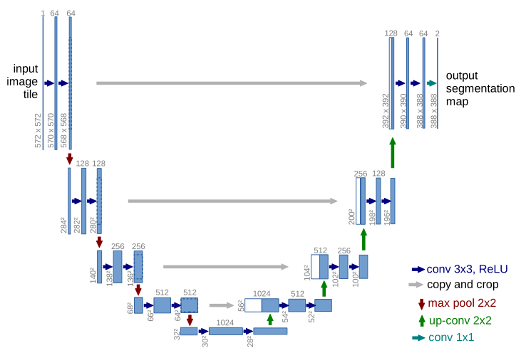

# U-Net Pytorch实现

## 论文部分


U-Net是其作者参加ISBI Challenge时提出的一种图像分割网络，其结构简单，参数量较小，使用数据量较少的图像也能获得不错的效果，在作者参加大赛时，其数据仅仅只有30张图像，因此U-Net非常适合用于医学图像分割。

U-Net的名字取自其U形的形状(U-Net的结构图，下图，来源于论文)，U形的左边时该网络的收缩路径(contracting path)，而右边则是该网络的扩张路径(expanding path)。收缩路径用于提取图像的特征，其提取特征的方法是基于卷积神经网络，众多实验证明，卷积神经网络具有自动提取输入的特征的能力，换言之，其具有良好的特征表达能力。而扩张路径能够将特征进行应用，其通过反卷积以及上采样操作将特征图恢复到与输入相同尺寸的图像上。

- 

收缩路径由4个block组成，每个block使用了2个卷积层以及一个池化层,其中卷积层的卷积核大小为$3\times3$，无padding，stride为1，池化层采用了最大池化层,其池化区域为$2\times2$，padding为0，stride为2，且每个block的卷积核的数量随着block的增多而增多。

扩张路径与收缩路径相似，同样有4个block组成,每个block之前使用反卷积操作将特征图的尺寸进行扩大，每个block含有2个卷积层，每个卷积层使用与收缩路径相同的卷积核大小，与收缩路径不同的是，其卷积核的数量是逐渐减少的。

与FCN显著不同的一点是，其使用了concatenate的方法将特征进行融合，这样的操作可以直接将收缩路径上的特征拼接到扩张路径上。卷积神经网络中与此相似的结构是ResNet中的残差结构，它们同样可以将浅层的特征进行传递,使用了更多的浅层特征,ResNet的残差连接与U-Net连接不同的地方，是ResNet的最浅层并不与最深层进行连接。此外，U-Net特征融合前对特征图进行了裁剪(crop)，这是由于收缩路径上得到的特征图尺寸与扩张路径上得到的特征图尺寸并不相同，而是前者略大于后者。

## 网络实现(与论文相同)

- 卷积 Block

```python
import torch
import torch.nn as nn

class ConvBlock(nn.Module):
    def __init__(self, indim, middim, outdim):
        super(ConvBlock, self).__init__()
        self.conv1 = nn.Conv2d(indim, middim, 3)
        self.conv2 = nn.Conv2d(middim, outdim, 3)
        self.relu = nn.ReLU(inplace=True)
        self.bn1 = nn.BatchNorm2d(middim)
        self.bn2 = nn.BatchNorm2d(outdim)

    def forward(self, x):
        x = self.conv1(x)
        x = self.relu(self.bn1(x))
        x2 = self.conv2(x1)
        x = self.relu(self.bn2(x))
        return x
```

- 收缩路径 - 卷积 Block

```python
class DownConvBlock(nn.Module):
    def __init__(self, indim, middim, outdim):
        super(DownConvBlock, self).__init__()
        self.conv = ConvBlock(indim, middim, outdim)
        self.pool = nn.Maxpool2d(2, 2)

    def forward(self, x):
        x1 = self.conv(x)
        x = self.pool(x1)
        return x1, x
```

- 扩张路径 - 卷积 Block

```python
class UpConvBlock(nn.Module):
    def __init__(self, indim, middim, outdim):
        super(DownConvBlock, self).__init__()
        self.conv = ConvBlock(indim, middim, outdim)

    def forward(self, formalX, x):
        sizeF = formalX.size(3)
        sizeB = x.size(3)
        # 注意sizeF和sizeB为偶数时，成立，否则不成立
        formalX = formalX[:, :, sizeF//2-sizeB//2:sizeF//2+sizeB//2,
        sizeF//2-sizeB//2:sizeF//2+sizeB//2]
        x = torch.cat([formalX, x], dim=1)
        x = self.conv(x)
        return x
```

- U-Net 实现

```python
class UNet(nn.Module):
	def __init__(self):
        super(UNet, self).__init__()
        self.down1 = DownConvBlock(1, 64, 64)
        self.down2 = DownConvBlock(64, 128, 128)
        self.down3 = DownConvBlock(128, 256, 256)
        self.down4 = DownConvBlock(256, 512, 512)
        self.bottom = ConvBlock(512, 1024, 512)
        self.up1 = UpConvBlock(1024, 512, 256)
        self.up2 = UpConvBlock(512, 256, 128)
        self.up3 = UpConvBlock(256, 128, 64)
        self.up4 = UpConvBlock(128, 64, 64)
        self.final = nn.Conv2d(64, 2, 1)
       
    def forward(self, x):
        x1, x = self.down1(x)
        x2, x = self.down2(x)
        x3, x = self.down3(x)
        x4, x = self.down4(x)
        x = self.bottom(x)
        x = self.up1(x4, x)
        x = self.up2(x3, x)
        x = self.up3(x2, x)
        x = self.up4(x1, x)
        logits = self.final(x)
        return logits
```

## 网络复现(与论文不同，输入输出尺寸相同)

- 收缩路径 - 卷积 Block

```python
import torch
import torch.nn as nn

class DownConv(nn.Module):
    def __init__(self, indim, outdim, isPool=True):
        super(DownConv, self).__init__()
        self.isPool = isPool
        self.conv1 = nn.Conv2d(indim, outdim, 3, padding=1)
        self.conv2 = nn.Conv2d(outdim, outdim, 3, padding=1)
        self.pool = nn.MaxPool2d(2, 2)
        self.bn = nn.BatchNorm2d(outdim)
        self.relu = nn.ReLU(inplace=True)

    def forward(self, x):
        x = self.conv1(x)
        x1 = self.relu(self.bn(x))
        x = self.conv2(x1)
        x2 = self.relu(self.bn(x))
        if self.isPool:
            x = self.pool(x2)
            return x2, x
        else:
            return x
```

- 扩张路径 - 卷积 Block

```python
from torch.nn import functional as F

class UpConv(nn.Module):
    def __init__(self, indim, outdim):
        super(UpConv, self).__init__()
        self.conv1 = nn.Conv2d(2*indim, indim, 3, padding=1)
        self.conv2 = nn.Conv2d(indim, outdim, 3, padding=1)
        self.bn1 = nn.BatchNorm2d(indim)
        self.bn2 = nn.BatchNorm2d(outdim)
        self.relu = nn.ReLU(inplace=True)

    def forward(self, formalX, x):
        size = formalX.size(3)
        x = F.interpolate(x, [size, size],
                          mode='bilinear', align_corners=True)
        x = torch.cat([formalX, x], dim=1)
        x = self.conv1(x)
        x = self.relu(self.bn1(x))
        x = self.conv2(x)
        x = self.relu(self.bn2(x))
        return x
```

- U-Net 实现

```python
class UNet(nn.Module):
    def __init__(self):
        super(UNet, self).__init__()
        self.down1 = DownConv(1, 64)
        self.down2 = DownConv(64, 128)
        self.down3 = DownConv(128, 256)
        self.down4 = DownConv(256, 512)
        self.bottom = DownConv(512, 512, isPool=False)
        self.up1 = UpConv(512, 256)
        self.up2 = UpConv(256, 128)
        self.up3 = UpConv(128, 64)
        self.up4 = UpConv(64, 64)
        self.final = nn.Conv2d(64, 1, 1)

        for m in self.modules():
            if isinstance(m, nn.Conv2d):
                nn.init.xavier_uniform_(m.weight.data)

    def forward(self, x):
        x1, x = self.down1(x)
        x2, x = self.down2(x)
        x3, x = self.down3(x)
        x4, x = self.down4(x)
        x = self.bottom(x)
        x = self.up1(x4, x)
        x = self.up2(x3, x)
        x = self.up3(x2, x)
        x = self.up4(x1, x)
        logits = self.final(x)
        return logits
```

以上为U-Net论文网络模型的Pytorch实现。

​      